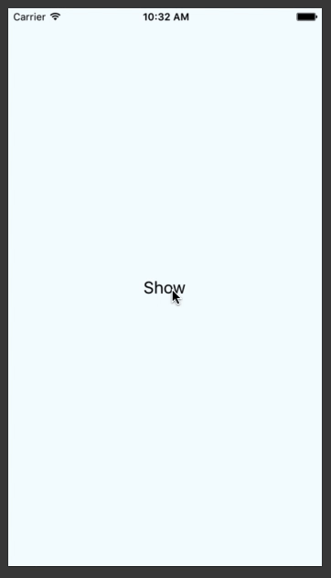

# react-native-simple-message-bar


[](https://www.codacy.com/app/ktgr45/react-native-message-bar?utm_source=github.com&amp;utm_medium=referral&amp;utm_content=KBLNY/react-native-message-bar&amp;utm_campaign=Badge_Grade)
 
[](https://npmjs.org/package/react-native-message-bar "View this project on npm")

A simple 1-line message bar notification component displayed at the top of the screen for React Native (Android and iOS) projects.




## Content
- [Features](#features)
- [Installation](#installation)
- [Basic Usage](#basic-usage)
- [License](#license)


## Features
- 1-line message


## Installation
Make sure that you are in your React Native project directory and run:
```batch
$ npm install react-native-simple-message-bar --save
```


---

## License
`React-Native-Simple-Message-Bar` is released under MIT License. See `LICENSE` for details.

>**Copyright &copy; 2016 KBLNY.**

*Please provide attribution, it is greatly appreciated.*
